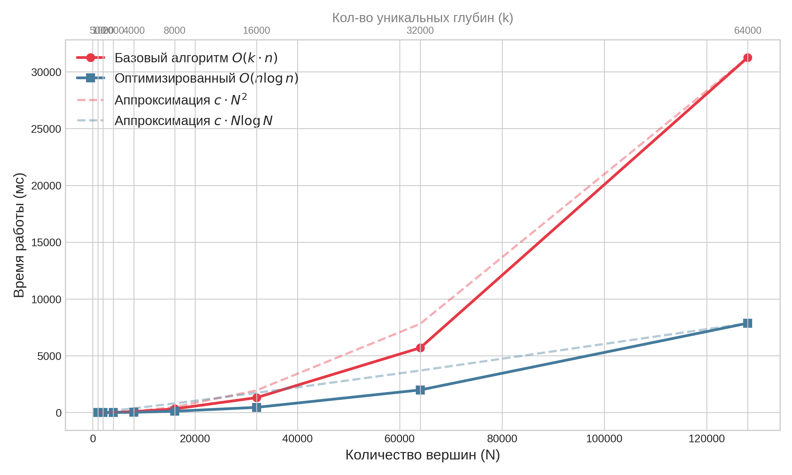
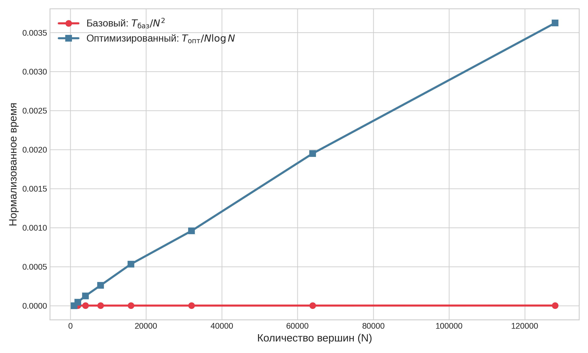

# TreeMaxFlow — Максимальный поток в древовидных сетях

Реализация алгоритмов вычисления величины всплеска (burst) в древовидных сетях: базового O(k·n) и оптимизированного O(n log n) с использованием техники Small-to-Large.

Дипломная работа: **«О стационарных и динамических потоках в древовидных сетях»**
Южный федеральный университет

---

## Постановка задачи

Рассмотрим древовидную сеть T с корнем-источником s. Каждое ребро (u, v) имеет пропускную способность c(u, v). Поток f в такой сети определяется для каждого ребра значением 0 ≤ f(u, v) ≤ c(u, v), причём в каждом внутреннем узле выполняется условие баланса:

```
∑ f(u, v) = f(parent(u), u)  для каждого внутреннего u ≠ s
```

**Величина всплеска** — это суммарный объём дополнительного потока, который может быть направлен к листьям, находящимся на разной глубине, при нарушении баланса. Формально, всплеск вычисляется как:

```
Burst = Σ_d F^(d)_max
```

где суммирование ведётся по всем различным глубинам d листьев, а F^(d)_max — максимальный поток, достижимый к листьям на глубине d.

---

## Алгоритмы

### Базовый алгоритм — O(k · n)

Наивный подход: для каждой уникальной глубины d вычисляется максимальный поток F^(d)_max отдельным проходом «снизу вверх» (bottom-up). Общая сложность — O(k · n), где k — число различных глубин листьев, n — число вершин.

```
Для каждой уникальной глубины d:
    dp[v] = ∞, если depth(v) = d и v — лист
    dp[v] = 0, иначе (для листьев)
    dp[u] = Σ min(c(u,v), dp[v])  для внутренних u (bottom-up)
  Burst += dp[root]
```

### Оптимизированный алгоритм — O(n log n)

Вместо k отдельных проходов используется один проход с техникой **Small-to-Large merge**. Для каждого узла u хранится отображение M[u]: глубина → вклад в поток. При обработке узла:

1. Выбирается ребёнок v_max с наибольшим |M[v]|
2. M[u] получает содержимое M[v_max] (move semantics — O(1))
3. Для каждого остального ребёнка v: элементы M[v] сливаются в M[u]
4. Значения в M[u] усекаются: M[u][d] = min(c(u, v_max), M[u][d])

Общая сложность — **O(n log n)** за счёт Small-to-Large: каждый элемент перемещается O(log n) раз.

---

## Структура проекта

```
TreeMaxFlow/
├── main.cpp                      # Ядро: C++ реализация алгоритмов + бенчмарки
├── TreeMaxFlow.vcxproj           # Файл проекта Visual Studio
├── TreeMaxFlow.vcxproj.filters   # Фильтры VS
├── demo.html                     # Интерактивная визуализация (HTML/Canvas/JS)
├── plot.py                       # Построение графиков (combined plot)
├── plot2.py                      # Построение графиков (отдельные файлы)
├── experiment_results.txt        # Результаты бенчмарка (N, k, время)
├── benchmark_results.csv         # Детальные результаты замеров
├── abs_time.png                  # График: абсолютное время работы
├── asymptotic.png                # График: верификация асимптотики
├── burst_complexity_analysis.png # Комбинированный график сложности
└── myenv/                        # Python virtualenv (не отслеживается)
```

---

## Сборка и запуск

### Требования
- **C++ компилятор** с поддержкой C++17 (g++, clang++, MSVC)
- **Python 3** + matplotlib (только для построения графиков)

### Компиляция и запуск эксперимента

```bash
g++ -O2 -std=c++17 -o experiment main.cpp
./experiment
```

Результаты сохраняются в `experiment_results.txt`.

### Построение графиков

```bash
pip install matplotlib numpy

# Комбинированный график (2 панели)
python plot.py

# Отдельные графики
python plot2.py
```

Сохраняются: `burst_complexity_analysis.png`, `abs_time.png`, `asymptotic.png`.

---

## Результаты экспериментов

Бенчмарк проведён на структуре данных «гребёнка» (comb tree) — дерево, максимально способное проявить burst-эффект.

| N (вершин) | k (уник. глубин) | Базовый O(k·n) (мс) | Оптимизированный O(n log n) (мс) | Ускорение |
|-----------|------------------|---------------------|--------------------------------|-----------|
| 1 000 | 500 | 1 | 0 | — |
| 2 000 | 1 000 | 5 | 1 | 5× |
| 4 000 | 2 000 | 21 | 6 | 3.5× |
| 8 000 | 4 000 | 82 | 27 | 3× |
| 16 000 | 8 000 | 328 | 119 | 2.8× |
| 32 000 | 16 000 | 1 315 | 459 | 2.9× |
| 64 000 | 32 000 | 5 701 | 1 993 | 2.9× |
| 128 000 | 64 000 | 31 258 | 7 868 | 4× |

### Графики

**Абсолютное время работы:**



**Верификация асимптотики (нормализованное время):**



Нормализованное время T/N² (базовый) и T/(N log N) (оптимизированный) стремится к константе, что подтверждает теоретические оценки сложности.

---

## Интерактивное демо

Файл `demo.html` — полностью клиентская визуализация (без сервера). Открывается в любом современном браузере.

### Возможности
- Параллельная анимация двух алгоритмов на одном дереве
- Настройка размера дерева (N = 8..24), типа (гребёнка / сбалансированное), скорости
- Пошаговый режим (кнопка «Шаг»)
- Запись анимации в WebM-видео с возможностью скачивания
- Отображение промежуточных состояний: значения dp[u] для базового, содержимое M[u] для оптимизированного

### Запуск

Просто откройте `demo.html` в браузере. Для записи видео используйте кнопку «Записать WebM».

---

## Алгоритмическая сложность

| Алгоритм | Время | Память |
|----------|-------|--------|
| Базовый (per depth) | O(k · n) | O(n) |
| Оптимизированный (Small-to-Large) | O(n log n) | O(n) |

Где:
- **n** — число вершин в дереве
- **k** — число различных глубин листьев (k ≤ n)
- Наихудший случай для базового: k = n/2 (гребёнка), тогда O(n²)
- Оптимизированный всегда O(n log n) независимо от k

---

## Зависимости

| Компонент | Зависимости |
|-----------|-------------|
| Ядро (main.cpp) | Только стандартная библиотека C++17 |
| Графики (plot.py) | Python 3, matplotlib, numpy |
| Демо (demo.html) | Современный браузер (Canvas, ES2020) |
